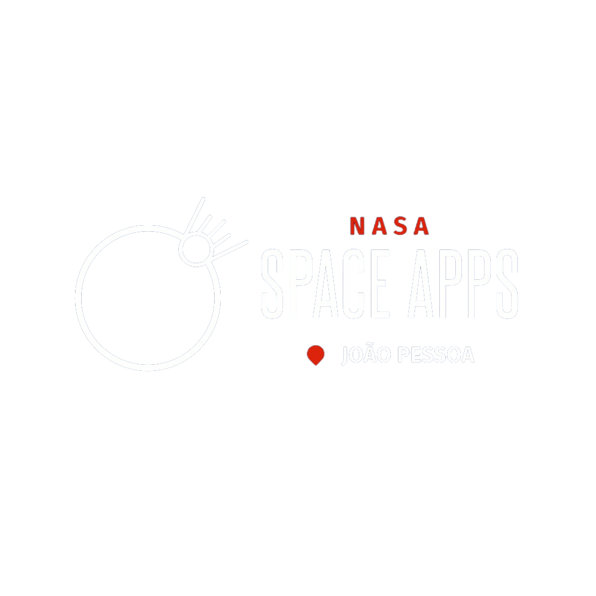

# 🌟 Cosmic Tales: Space Weather Through the Eyes of Earthlings

<div align="center">



**[English](#english) | [Português](#português)**

[](https://www.spaceappschallenge.org/)

</div>

---

<a name="english"></a>
## 🇺🇸 English Version

### 📖 About the Project

**Cosmic Tales** is an **interactive educational platform** developed for the [NASA Space Apps Challenge 2024](https://www.spaceappschallenge.org/2024/challenges/stellar-stories-space-weather-through-the-eyes-of-earthlings/), designed to explain space weather and its impacts on Earth in an engaging and accessible way.

**NOTE:** If you are acessing this website from other country apart of Brazil, it will be automatically translated to your navigator language and maybe some images will not load.

Although the Sun is 150 million kilometers away from Earth, its activity significantly impacts our daily lives. "Space weather" refers to variations in the space environment between the Sun and Earth, including:

- **Solar Flares** ☄️ - Intense bursts of radiation from the Sun
- **Coronal Mass Ejections (CME)** 🌊 - Large plasma clouds ejected from the Sun  
- **Solar Wind** 💨 - Constant stream of solar particles
- **Geomagnetic Storms** ⚡ - Disturbances in Earth's magnetic field

### ✨ Key Features

#### 🏠 Home Page
- Attractive introduction with animated visuals
- Real-time solar system statistics
- Smooth navigation to all sections
- Responsive design for all devices

#### ☁️ Space Weather Section
- **Real-time data** from NASA DONKI and NOAA SWPC APIs
- Current solar activity information
- Latest detected solar flares
- Geomagnetic storm risk assessment
- Aurora borealis forecasts

#### 📚 Interactive Stories
Explore 4 unique narratives showing different perspectives on space weather:

1. **Solar Flare Journey** ☄️ - Follow a solar flare's trip to Earth
2. **GPS Farmer José** 🌾 - Discover how space weather affects modern agriculture
3. **Electric Grid Guardians** ⚡ - Protect power grids during solar storms
4. **Aurelito's Journey** 🚀 - Educational adventure about space weather

#### 🎮 Space Challenge Game
- **Interactive canvas-based game**
- Navigate a spaceship through space
- Collect star coins while avoiding solar radiation
- Real-time coin and distance tracking
- High score system with localStorage
- Responsive controls (click/tap to fly)
- Light and dark theme support

#### 🤖 Aurelito - Interactive Guide
Meet **Aurelito**, your personal guide who:
- Offers contextual tips in each section
- Changes expressions based on content
- Can be minimized/maximized as needed
- Makes navigation more fun and educational

#### 🌓 Light/Dark Theme
- Toggle between light and dark modes
- Smooth transitions
- Optimized for both themes across all sections
- User preference saved in localStorage

### 🛠️ Technologies Used

- **HTML5** - Semantic and accessible structure
- **CSS3** - Animations, gradients, and responsive design
- **JavaScript (Vanilla)** - Interactivity and API integration
- **Canvas API** - Game rendering and physics
- **Font Awesome 6.4.2** - Elegant icons
- **Google Fonts** - Modern typography (Poppins and Space Mono)
- **NASA DONKI API** - Real-time space weather data
- **NOAA SWPC** - Geomagnetic storm information
- **LocalStorage** - User preferences and high scores

### 🚀 How to Run

#### Prerequisites
- Modern web browser (Chrome, Firefox, Edge, Safari)
- Internet connection (for APIs and external fonts)

#### Installation

```bash
# Clone the repository
git clone https://github.com/Vinii225/StellarStories_NasaSpaceApps.git

# Navigate to project folder
cd StellarStories_NasaSpaceApps

# Open index.html in your browser
# Windows: start index.html
# macOS: open index.html  
# Linux: xdg-open index.html
```

Or simply drag `index.html` to your browser.

### 📁 Project Structure

```
StellarStories/
├── index.html              # Main page
├── README.md              # Documentation
├── Images/
│   ├── EventLogo/         # Event logos
│   └── GuideCharacter/    # Aurelito images
├── js/
│   ├── script.js          # Main JavaScript logic
│   └── game.js            # Space game logic (484 lines)
├── pages/                 # Story pages
│   ├── JornadaDeAurelito/
│   ├── RedesEletricas/
│   ├── TempestadeSolar/
│   ├── VentoSolar/
│   └── GpsDoAgricultorJose/
└── styles/
    ├── styles.css         # Main styles
    ├── game.css           # Game-specific styles (437 lines)
    └── story-common.css   # Shared story styles
```

### 🎨 Design Highlights

- **Accessibility** - High contrast colors and readable text
- **Responsiveness** - Works on desktop, tablet, and mobile
- **Smooth Animations** - Attractive transitions and visual effects
- **Space Theme** - Cosmos-inspired color palette
- **Interactivity** - Clickable and user-responsive elements
- **Performance** - Optimized rendering and efficient code

### 🌐 APIs Used

#### NASA DONKI (Database Of Notifications, Knowledge, Information)
- Solar flare data
- CME (Coronal Mass Ejections) information
- Geomagnetic storm alerts

#### NOAA Space Weather Prediction Center
- Solar activity forecasts
- Geomagnetic indices
- Space weather alerts

### 🎯 Educational Goals

- Educate children and youth about space phenomena accessibly
- Illustrate space weather impacts on different communities
- Visualize scientific data creatively
- Tell interactive stories from various perspectives
- Engage the public with an immersive digital experience

### 🤝 How to Contribute

Contributions are welcome! To contribute:

1. Fork the project
2. Create a feature branch (`git checkout -b feature/NewFeature`)
3. Commit your changes (`git commit -m 'Add new feature'`)
4. Push to branch (`git push origin feature/NewFeature`)
5. Open a Pull Request

### 👥 Team

- João Felipe Andrade dos Santos
- Maria Laura Guedes dos Santos
- Luis Eduardo Gomes Soares
- Luana Gabriella Pereira Macedo
- Thiago Victor da Silva Macedo
- Vinícius Ares Monteiro de Lima

### 📄 License

This project is licensed under the MIT License. See [LICENSE](LICENSE) for details.

### 🔗 Useful Links

- [NASA Space Apps Challenge](https://www.spaceappschallenge.org/)
- [Stellar Stories Challenge](https://www.spaceappschallenge.org/2024/challenges/stellar-stories-space-weather-through-the-eyes-of-earthlings)
- [NASA Space Weather](https://www.nasa.gov/mission_pages/sunearth/spaceweather/)
- [NOAA SWPC](https://www.swpc.noaa.gov/)
- [Solar Dynamics Observatory](https://sdo.gsfc.nasa.gov/)

### 🌟 Acknowledgments

- NASA for providing open APIs and data
- NOAA Space Weather Prediction Center
- NASA Space Apps community
- All educators and scientists making space knowledge accessible

---

<a name="português"></a>
## 🇧🇷 Versão em Português

### 📖 Sobre o Projeto

**Cosmic Tales** é uma **plataforma educacional interativa** desenvolvida para o [NASA Space Apps Challenge 2024](https://www.spaceappschallenge.org/2024/challenges/stellar-stories-space-weather-through-the-eyes-of-earthlings/), projetada para explicar o clima espacial e seus impactos na Terra de forma envolvente e acessível.

Embora o Sol esteja a 150 milhões de quilômetros da Terra, sua atividade impacta significativamente nossas vidas diárias. O "clima espacial" refere-se às variações no ambiente espacial entre o Sol e a Terra, incluindo:

- **Erupções Solares** ☄️ - Explosões intensas de radiação do Sol
- **Ejeções de Massa Coronal (CME)** 🌊 - Grandes nuvens de plasma ejetadas do Sol
- **Vento Solar** 💨 - Fluxo constante de partículas solares  
- **Tempestades Geomagnéticas** ⚡ - Distúrbios no campo magnético terrestre

### ✨ Funcionalidades Principais

#### 🏠 Página Principal
- Introdução atrativa com visuais animados
- Estatísticas do sistema solar em tempo real
- Navegação suave para todas as seções
- Design responsivo para todos os dispositivos

#### ☁️ Seção de Clima Espacial
- **Dados em tempo real** das APIs NASA DONKI e NOAA SWPC
- Informações sobre atividade solar atual
- Últimas erupções solares detectadas
- Avaliação de risco de tempestades geomagnéticas
- Previsões de auroras boreais

#### 📚 Histórias Interativas
Explore 4 narrativas únicas mostrando diferentes perspectivas sobre o clima espacial:

1. **Jornada da Erupção Solar** ☄️ - Acompanhe uma erupção solar em sua viagem até a Terra
2. **GPS do Agricultor José** 🌾 - Descubra como o clima espacial afeta a agricultura moderna
3. **Guardiões da Rede Elétrica** ⚡ - Proteja redes elétricas durante tempestades solares
4. **Jornada de Aurelito** 🚀 - Aventura educativa sobre clima espacial

#### 🎮 Jogo Desafio Espacial
- **Jogo interativo baseado em canvas**
- Navegue uma nave espacial pelo espaço
- Colete moedas estelares evitando radiação solar
- Rastreamento em tempo real de moedas e distância
- Sistema de recordes com localStorage
- Controles responsivos (clique/toque para voar)
- Suporte para temas claro e escuro

#### 🤖 Aurelito - Guia Interativo
Conheça o **Aurelito**, seu guia pessoal que:
- Oferece dicas contextuais em cada seção
- Muda de expressão baseado no conteúdo
- Pode ser minimizado/maximizado conforme necessidade
- Torna a navegação mais divertida e educativa

#### 🌓 Tema Claro/Escuro
- Alterne entre modos claro e escuro
- Transições suaves
- Otimizado para ambos os temas em todas as seções
- Preferência do usuário salva no localStorage

### 🛠️ Tecnologias Utilizadas

- **HTML5** - Estrutura semântica e acessível
- **CSS3** - Animações, gradientes e design responsivo
- **JavaScript (Vanilla)** - Interatividade e integração com APIs
- **Canvas API** - Renderização e física do jogo
- **Font Awesome 6.4.2** - Ícones elegantes
- **Google Fonts** - Tipografia moderna (Poppins e Space Mono)
- **NASA DONKI API** - Dados de clima espacial em tempo real
- **NOAA SWPC** - Informações sobre tempestades geomagnéticas
- **LocalStorage** - Preferências do usuário e recordes

### 🚀 Como Executar

#### Pré-requisitos
- Navegador web moderno (Chrome, Firefox, Edge, Safari)
- Conexão com internet (para APIs e fontes externas)

#### Instalação

```bash
# Clone o repositório
git clone https://github.com/Vinii225/StellarStories_NasaSpaceApps.git

# Navegue até a pasta do projeto
cd StellarStories_NasaSpaceApps

# Abra index.html no seu navegador
# Windows: start index.html
# macOS: open index.html
# Linux: xdg-open index.html
```

Ou simplesmente arraste `index.html` para seu navegador.

### 📁 Estrutura do Projeto

```
StellarStories/
├── index.html              # Página principal
├── README.md              # Documentação
├── Images/
│   ├── EventLogo/         # Logos do evento
│   └── GuideCharacter/    # Imagens do Aurelito
├── js/
│   ├── script.js          # Lógica JavaScript principal
│   └── game.js            # Lógica do jogo espacial (484 linhas)
├── pages/                 # Páginas das histórias
│   ├── JornadaDeAurelito/
│   ├── RedesEletricas/
│   ├── TempestadeSolar/
│   ├── VentoSolar/
│   └── GpsDoAgricultorJose/
└── styles/
    ├── styles.css         # Estilos principais
    ├── game.css           # Estilos específicos do jogo (437 linhas)
    └── story-common.css   # Estilos compartilhados das histórias
```

### 🎨 Destaques do Design

- **Acessibilidade** - Cores de alto contraste e texto legível
- **Responsividade** - Funciona em desktop, tablet e mobile
- **Animações Suaves** - Transições e efeitos visuais atraentes
- **Tema Espacial** - Paleta de cores inspirada no cosmos
- **Interatividade** - Elementos clicáveis e responsivos ao usuário
- **Performance** - Renderização otimizada e código eficiente

### 🌐 APIs Utilizadas

#### NASA DONKI (Database Of Notifications, Knowledge, Information)
- Dados sobre erupções solares
- Informações sobre CMEs (Ejeções de Massa Coronal)
- Alertas de tempestades geomagnéticas

#### NOAA Space Weather Prediction Center
- Previsões de atividade solar
- Índices geomagnéticos
- Alertas de clima espacial

### 🎯 Objetivos Educacionais

- Educar crianças e jovens sobre fenômenos espaciais de forma acessível
- Ilustrar os impactos do clima espacial em diferentes comunidades
- Visualizar dados científicos de forma criativa
- Contar histórias interativas de várias perspectivas
- Engajar o público com uma experiência digital imersiva

### 🤝 Como Contribuir

Contribuições são bem-vindas! Para contribuir:

1. Fork o projeto
2. Crie uma branch para sua feature (`git checkout -b feature/NovaFuncionalidade`)
3. Commit suas mudanças (`git commit -m 'Adiciona nova funcionalidade'`)
4. Push para a branch (`git push origin feature/NovaFuncionalidade`)
5. Abra um Pull Request

### 👥 Equipe

- João Felipe Andrade dos Santos
- Maria Laura Guedes dos Santos
- Luis Eduardo Gomes Soares
- Luana Gabriella Pereira Macedo
- Thiago Victor da Silva Macedo
- Vinícius Ares Monteiro de Lima

### 📄 Licença

Este projeto está sob a licença MIT. Veja [LICENSE](LICENSE) para mais detalhes.

### 🔗 Links Úteis

- [NASA Space Apps Challenge](https://www.spaceappschallenge.org/)
- [Desafio Stellar Stories](https://www.spaceappschallenge.org/2024/challenges/stellar-stories-space-weather-through-the-eyes-of-earthlings)
- [NASA Space Weather](https://www.nasa.gov/mission_pages/sunearth/spaceweather/)
- [NOAA SWPC](https://www.swpc.noaa.gov/)
- [Solar Dynamics Observatory](https://sdo.gsfc.nasa.gov/)

### 🌟 Agradecimentos

- NASA por fornecer APIs e dados abertos
- NOAA Space Weather Prediction Center
- Comunidade NASA Space Apps
- Todos os educadores e cientistas que tornam o conhecimento espacial acessível

---

<div align="center">

**Desenvolvido com 💙 para o NASA Space Apps Challenge 2024**

*"Explorando o cosmos, com uma história de cada vez"* 🚀✨

**[⬆ Voltar ao topo](#-cosmic-tales-space-weather-through-the-eyes-of-earthlings)**

</div>
